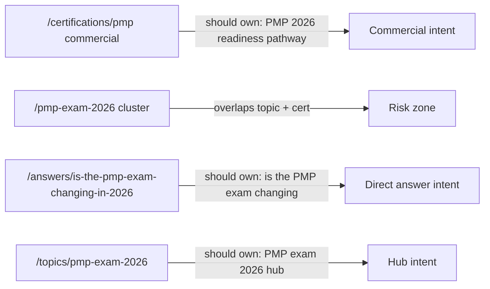

# T-022 — Keywords and Anchors Phase Two

## Ask mode findings (summary)

### Framework and metadata system

| Item | Finding |
|------|---------|
| Framework | Next.js 15 App Router in [`frontend/`](frontend/) |
| Metadata hub | [`frontend/lib/site-metadata.ts`](frontend/lib/site-metadata.ts) — `buildPageMetadata()`, `buildCertMetadata()`, `defaultSiteMetadata` |
| Canonicals | [`frontend/lib/canonical.ts`](frontend/lib/canonical.ts) + `PMS_SITE_URL` from [`frontend/config/pms-site.ts`](frontend/config/pms-site.ts) |
| Indexing | [`frontend/lib/indexing-metadata.ts`](frontend/lib/indexing-metadata.ts) |
| Sitemap | [`frontend/app/sitemap.ts`](frontend/app/sitemap.ts) — separate from page SEO copy |

Metadata is **per-route**: static `export const metadata` or `generateMetadata()` in `frontend/app/(site)/**/page.tsx`. Content models already carry `title`, `description`, and link arrays.

### Content / SEO data models (existing)

| Area | Location | SEO fields today |
|------|----------|------------------|
| Answers | [`frontend/content/answers/types.ts`](frontend/content/answers/types.ts), [`pages.ts`](frontend/content/answers/pages.ts) | `title`, `description`, `question` (H1), `relatedPages`, `relatedAnswers`, `relatedCourses`, `ctaHref`/`ctaLabel` |
| Topics | [`frontend/content/topics/types.ts`](frontend/content/topics/types.ts), [`hubs.ts`](frontend/content/topics/hubs.ts) | `title`, `description`, `h1`, `resources`, `relatedAnswers` |
| PMP cluster | [`frontend/content/pmp/pages.ts`](frontend/content/pmp/pages.ts), [`flagship-t169.ts`](frontend/content/pmp/flagship-t169.ts) | `T169_SEO`, `T169_PMP_PAGE` for `/pmp-exam-2026` cluster |
| Certifications | [`frontend/data/siteData.ts`](frontend/data/siteData.ts) + [`buildCertMetadata()`](frontend/lib/site-metadata.ts) | Generic `${cert.name} exam preparation` title; family-specific descriptions in [`t176-claims.ts`](frontend/content/t176-claims.ts) |
| FAQ | [`frontend/content/faq/`](frontend/content/faq/) + [`/faq` page](frontend/app/(site)/faq/page.tsx) | Page-level metadata; FAQ schema via [`FaqPageJsonLd`](frontend/components/seo/FaqPageJsonLd.tsx) |
| AI keyword clusters (public) | [`frontend/lib/ai-files/builders.ts`](frontend/lib/ai-files/builders.ts) → `/pmp-keywords.json` | Planning clusters only; **not** a page-level keyword map; no volume |

**No `PageSeoConfig` type or Phase Two keyword map exists yet.**

### Internal links (existing)

- Answer pages: [`AnswerPage.tsx`](frontend/components/answers/AnswerPage.tsx) — "Related pathways/guides/answers" from content arrays
- Topic hubs: [`TopicHubPage.tsx`](frontend/components/topics/TopicHubPage.tsx) — breadcrumbs + resource lists
- PMP cluster: [`PmpAuthorityPage.tsx`](frontend/components/pmp/PmpAuthorityPage.tsx) — `relatedLinks`
- Legal pattern: [`LegalRelatedLinks.tsx`](frontend/components/legal/LegalRelatedLinks.tsx) — reusable related-links block
- Guard script: [`scripts/seo/internal-links-check.mjs`](scripts/seo/internal-links-check.mjs) — homepage/footer/PMP hub only

**Gap:** Priority funnel links in task spec often point to `/certifications/pmp`, but many answer/topic links today point to `/pmp-exam-2026` cluster routes instead of the commercial cert page.

### Priority page inventory vs T-022 spec

| URL | Current title (approx) | Spec alignment | Main gap |
|-----|------------------------|----------------|----------|
| `/` | Matches `T169_SEO.homeTitle` | Good | Add optional related-links block if design allows |
| `/certifications` | "Certification pathways" | Partial | Title/description/H1 not aligned to spec drafts |
| `/certifications/pmp` | "PMP exam preparation" via `buildCertMetadata` | **Mismatch** | Spec wants "PMP 2026 Readiness Pathway"; H1 defaults to "PMP® Pathway" unless registry overrides |
| `/answers/is-the-pmp-exam-changing-in-2026` | Question as title/H1 | Good intent | Meta description differs; links miss `/certifications/pmp` and `/topics/pmp-exam-2026` with spec anchors |
| `/topics/pmp-exam-2026` | "PMP exam 2026: knowledge hub" | Partial | H1/title/description differ from spec; weak link to commercial page |
| `/faq` | "FAQ: PMP 2026, Certifications..." | Partial | Spec wants "PM Structure FAQ" framing |
| `/certifications/compare` | "Compare certifications" | **Mismatch** | Generic description; no related-links block to cert pages |
| Secondary certs (`pmi-rmp`, `prince2-practitioner`, `lss-yellow`, `lss-black`) | Generic cert metadata | Partial | Need spec titles/descriptions + compare/PMP links |
| `/membership`, `/community`, `/newsletter`, `/pm-service` | Generic marketing titles | Partial | Support-layer positioning not reflected in metadata |

### Weak anchors (inventory)

Only **2** clear in-body weak anchors found in priority surfaces:

- [`Home.tsx`](frontend/components/pages/Home.tsx) — "Read More" (blog cards)
- [`PMService.tsx`](frontend/components/pages/PMService.tsx) — "Learn More"

No widespread "click here" / "view details" in priority PMP funnel components. CTA buttons ("Get My PMP 2026 Roadmap") are intentionally short.

### Cannibalization risks (current)



- `/pmp-exam-2026` (cluster) and `/topics/pmp-exam-2026` both target 2026 exam intent — need clear roles in map (topic hub navigates; cluster is deep guide; cert page converts).
- `buildCertMetadata('pmp')` does not use `T169_SEO.pmpTitle` — commercial page under-branded vs cluster pages.

### Public exposure risk

- Internal docs live in [`docs/internal/`](docs/internal/) — not routed, not in sitemap (confirmed by T-015/T-017 guards).
- **Do not** copy MD/CSV into `frontend/public/` or link from nav/footer.

---

## Recommended architecture

### 1. Internal docs (required by spec)

Create exactly:

- [`docs/internal/PMSTRUCTURE_KEYWORD_ANCHOR_MAP_PHASE_2.md`](docs/internal/PMSTRUCTURE_KEYWORD_ANCHOR_MAP_PHASE_2.md) — spec template content
- [`docs/internal/pmstructure-keyword-anchor-map-phase-2.csv`](docs/internal/pmstructure-keyword-anchor-map-phase-2.csv) — spec rows + `Needs keyword research` for volume/difficulty
- Link from [`docs/internal/README.md`](docs/internal/README.md)

### 2. Code source of truth (recommended)

Add [`frontend/content/seo/phase-2-page-seo.ts`](frontend/content/seo/phase-2-page-seo.ts):

```ts
export type PageSeoConfig = {
  route: string;
  pageRole: string;
  primaryKeyword: string;
  secondaryKeywords?: string[];
  searchIntent?: string;
  funnelStage?: string;
  title: string;          // pass with noSuffix when includes brand
  description: string;
  h1?: string;
  canonicalPath: string;
  regionFocus?: string[];
  relatedLinks?: { href: string; label: string }[];
};
```

- Export `PHASE_2_PAGE_SEO: Record<string, PageSeoConfig>` for the 16 priority URLs in the spec CSV.
- **Do not** duplicate into public `pmp-keywords.json` (that file stays AI-oriented; no fake volume).
- Optional helper: `getPhase2Seo(path)` for pages + tests.

**Why TS constants, not CMS/MDX:** Repo already uses TypeScript content modules (`answers/pages.ts`, `topics/hubs.ts`, `flagship-t169.ts`); no CMS field layer for SEO on marketing pages. CSV remains the owner-editable export; TS module drives implementation.

### 3. Reusable internal-link component

Create [`frontend/components/seo/RelatedGuidesLinks.tsx`](frontend/components/seo/RelatedGuidesLinks.tsx) modeled on [`LegalRelatedLinks.tsx`](frontend/components/legal/LegalRelatedLinks.tsx):

- Props: `title`, `links: { href, label }[]`, optional `currentPath` to skip self-links
- Relative internal URLs only; accessible list markup
- Used on: PMP cert detail, compare, answer (priority slug), topic hub (priority slug), optionally homepage section

### 4. Metadata wiring strategy

| Page | Change |
|------|--------|
| `/` | Keep `T169_SEO` (already matches spec); reference map doc |
| `/certifications` | Update `page.tsx` metadata + server H1 if present |
| `/certifications/pmp` | Extend `buildCertMetadata('pmp')` **or** override in `generateMetadata` to use Phase 2 `title`/`description`; set PMP `detailHeroTitle` → "PMP 2026 Readiness Pathway" via [`cert-detail.ts`](frontend/lib/cert-detail.ts) / siteData or registry default |
| `/answers/[slug]` | For priority slug: align `pages.ts` title/description/links; use `noSuffix` in metadata when title includes brand |
| `/topics/[slug]` | Update `pmp-exam-2026` hub `title`, `description`, `h1` in `hubs.ts` |
| `/faq`, `/certifications/compare`, secondary certs, membership, community, newsletter, pm-service | Pull from `PHASE_2_PAGE_SEO` in respective `page.tsx` files |

**`buildPageMetadata` note:** When `title` already contains `| PM Structure`, pass `noSuffix: true` (pattern already used in answer/topic metadata).

### 5. Internal link updates (priority map)

Update content arrays / new `RelatedGuidesLinks` blocks per spec table:

- **Commercial hub:** `/certifications/pmp` ← from homepage, certifications hub, answer, topic, FAQ, compare, membership, community, pm-service
- **Answer page** → `/certifications/pmp`, `/topics/pmp-exam-2026`, `/faq` with spec anchor text
- **Topic hub** → `/certifications/pmp`, `/answers/...`, `/certifications/compare`
- **Compare** → all major cert pages with descriptive anchors
- **PMP cert detail** → add block "Plan your PMP 2026 route" linking answer/topic/FAQ/compare (replace generic "Read the PMP 2026 guide →" where appropriate)

Keep `/pmp-exam-2026` as **supporting** deep guide, not primary commercial CTA target.

### 6. Anchor cleanup (safe only)

| File | Replace |
|------|---------|
| `Home.tsx` blog card | "Read More" → article-specific label from post title or "Read article: {title}" |
| `PMService.tsx` | "Learn More" → descriptive target (e.g. "Explore project management advisory services") |

Do **not** change short CTA buttons ("Get My PMP 2026 Roadmap", "Join Waitlist").

### 7. Extend validation (optional, small)

Add [`scripts/seo/keyword-map-check.mjs`](scripts/seo/keyword-map-check.mjs):

- Assert Phase 2 priority routes have entries in `phase-2-page-seo.ts`
- Assert no duplicate `primaryKeyword` across priority map
- Assert related links use relative paths (no `www`, no `http://`)
- Wire as `npm run seo:keyword-map-check` in root [`package.json`](package.json) (only if script is added)

Existing checks to run after code changes: `seo:metadata-check`, `seo:h1-check`, `seo:internal-links-check`, `seo:canonical-check`, `npm run build -w @pms/frontend`.

---

## Pages in scope (Agent) vs later

### Update now (16 priority URLs from spec CSV)

`/`, `/certifications`, `/certifications/pmp`, priority answer, `/topics/pmp-exam-2026`, `/faq`, `/certifications/compare`, `/certifications/pmi-rmp`, `/certifications/prince2-practitioner`, `/certifications/lss-yellow`, `/certifications/lss-black`, `/membership`, `/community`, `/newsletter`, `/pm-service`, `/legal/terms`, `/legal/privacy` (metadata only, low SEO priority)

### Leave for later

- All "Planned pages to add later" in spec (do not add to sitemap)
- Full PMP cluster (`/pmp-exam-2026`, `/pmp-before-8-july-2026`, etc.) metadata pass
- Regional segment pages (`pmp-for-engineers`, GCC, South Asia) — not built
- `/compare/pmp-vs-*` routes — not built
- Bulk weak-anchor sweep across blog/newsletter/portal pages
- Keyword volume/difficulty columns — owner fills from tools

---

## Risks and mitigations

| Risk | Mitigation |
|------|------------|
| Double `| PM Structure` in titles | Use `noSuffix: true` when title is pre-formatted |
| Breaking cert routing | Only metadata + link copy changes; no route changes |
| Cannibalization | Enforce one `primaryKeyword` per page in map + check script |
| Compliance claims | Reuse `T176_*` / `T169_*` compliance wording; no new guarantees |
| Exposing internal map | Docs only under `docs/internal/`; grep guard in keyword-map-check |
| Lint noise | Pre-existing frontend lint failures unrelated; run frontend build as gate |

---

## Testing plan

1. `npm run seo:keyword-map-check` (if added)
2. `npm run seo:metadata-check` + `seo:h1-check` + `seo:canonical-check`
3. `npm run seo:internal-links-check`
4. `npm run build -w @pms/frontend`
5. Manual QA on 7 URLs from spec (view-source: title, meta description, canonical, H1, internal links)

---

## Owner inputs still required (document in internal MD)

- Regional keyword research export (UAE, KSA, Qatar, Pakistan, India, UK, global)
- Search volume, difficulty, CPC — leave CSV columns as `Needs keyword research`
- Final pricing, waitlist/live status for secondary certs
- Official community platform wording
- Verified testimonials/counts

---

## Agent mode can proceed?

**Yes**, after plan approval. Scope is docs + typed SEO module + priority metadata/link alignment + 2 weak-anchor fixes. No invented volume, no public keyword pages, no planned routes in sitemap.
