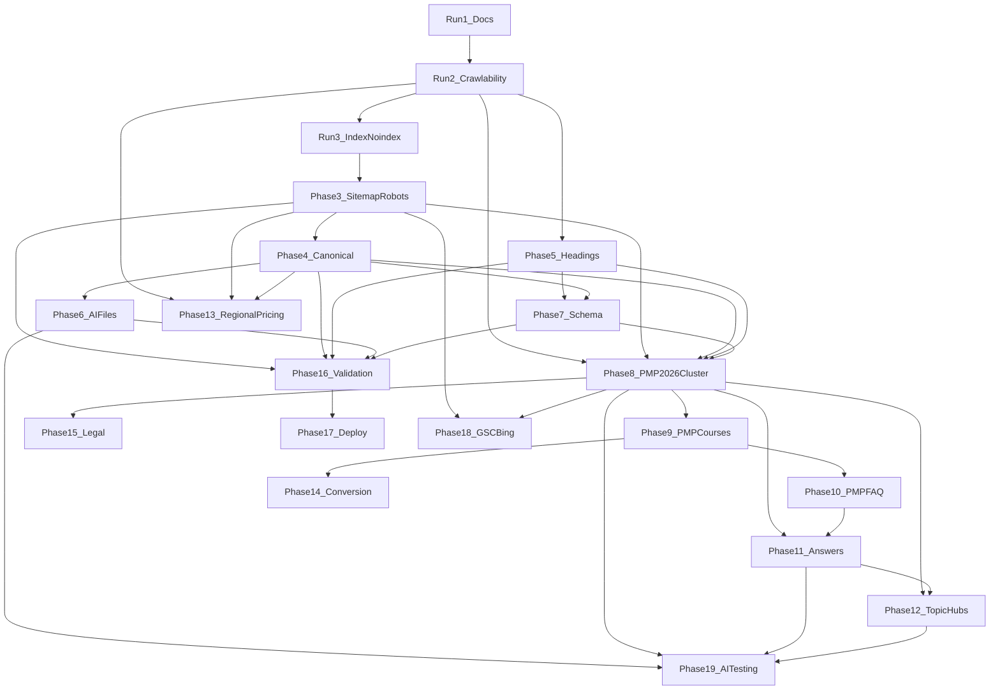

# PM Structure — Implementation Dependency Map

---

## Hard dependencies (must complete first)

| Phase | Blocked until |
|-------|----------------|
| Run 2 Crawlability | — (first implementation) |
| Run 3 Index/noindex | Run 2 |
| Phase 3 Sitemap | Run 3 (final index matrix) |
| Phase 4 Canonical | Run 3 |
| Phase 5 Headings | Run 2 (content in HTML) |
| Phase 6 AI files (pmp-*.json) | Phase 8 routes defined |
| Phase 7 Schema | Phase 5 headings; content for FAQ/Course |
| Phase 8 PMP cluster | Runs 2, 3, 4, 5 |
| Phase 9 PMP courses | Phase 8 hub |
| Phase 10 PMP FAQ | Phase 9 (course links) |
| Phase 11 Answers | Phases 8, 10 |
| Phase 12 Topic hubs | Phases 8, 11 |
| Phase 16 Validation | Rules from phases 3–7 defined |
| Phase 18 GSC | Phase 3 sitemap + Phase 8+ URLs |
| Phase 19 AI testing | Phases 6, 8–12 content live |

---

## Soft dependencies (recommended order)

| Phase | Recommended after |
|-------|-------------------|
| Phase 6 AI files (core) | Phase 4 — entity.json, faq.json can ship before PMP pages |
| Phase 13 Regional pricing | Run 2 — confirm non-blocking |
| Phase 14 Conversion | Phase 9 — CTAs on course pages |
| Phase 15 Legal | Anytime — update before Phase 8 public copy push |
| Phase 17 Deploy | Phase 16 |

---

## Data flow dependencies

| Consumer | Requires data from |
|----------|-------------------|
| `sitemap-pmp.xml` | PMP route modules (Phase 8–9) |
| `pmp-faq.json` | FAQ data model (Phase 10) |
| `pmp-routes.json` | Route registry (Phase 8–9) |
| FAQPage schema | Visible FAQ on same page |
| Course schema | Course page content + stable Offer |
| `seo:pmp-check` | All `/pmp*` routes (Phase 8–9) |
| GSC inspection list | Live deploy of priority URLs |

---

## Cross-cutting blockers

| Blocker | Affects | Resolution |
|---------|---------|------------|
| RegionGate blocks HTML | All phases | Run 2 |
| Missing INDEXING_MATRIX | Sitemap, GSC | Run 3 |
| 18 sibling docs missing | All content phases | Create during Run 1 completion or per-phase |
| `/go/*` indexing undecided | Sitemap Phase 3 | Owner decision |
| Counsel review not done | Phase 15, 8+ copy | External legal review |
