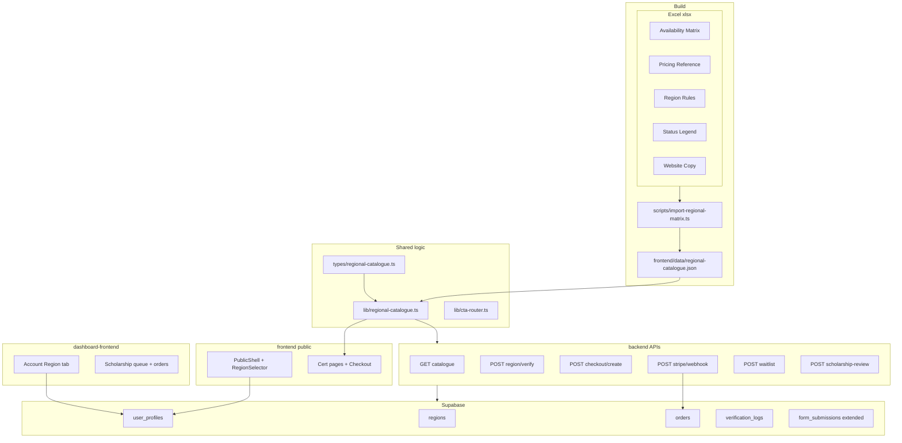

# Regional Availability & Pricing — Full Implementation Plan

**Status:** Ready for execution (plan only — not yet implemented)  
**Source of truth:** `PM_Structure_Regional_Availability_Matrix.xlsx`  
**Confirmed scope:** Full catalogue (29 courses, **55 offering rows**), region on **public site + dashboard** synced via Supabase  

**Phase 1 priority (website-first):**
- **Embed the full price × availability cross-matrix** in the public site (`regional-catalogue.json` generated from Excel). You adopt changes by re-running the import script and committing JSON until a dashboard editor exists later.
- **First-visit region modal** (see §L) — required on website open when no region is saved.
- **Dashboard** — region profile sync + ops queues in Phase 1; **matrix editing in dashboard is Phase 2** (read-only viewer optional).

This document is the **single canonical plan**. Every column and rule from the workbook is mapped below to code, APIs, database tables, and UI surfaces.

---

## A. Workbook inventory (100% coverage checklist)

### Sheet: Overview

| Workbook content | Implementation |
|------------------|----------------|
| One global course catalogue (no regional copies) | Single `course_offerings` / JSON catalogue; region affects price, status, CTA only |
| Regional pricing by residence + billing; checkout USD equivalent | `RegionProvider`, verify API, Stripe `usdCents` |
| Foundation = self-paced, direct checkout where allowed | `tierId: foundation` + `direct_checkout` / `scholarship_verify` |
| Professional = exam-focused, checkout or light verification | `professional` + status rules |
| Mastery = mentor-led, consultation; South Asia scholarship off by default | `mastery*` + `consultation_required` / `scholarship_unavailable` |
| Fallback: global price, scholarship review, waitlist | CTA router + APIs |
| Verification: IP + region + billing + residence (not phone alone) | `POST /api/region/verify` |
| Recommended user-facing message (long paragraph) | Region selector + `/legal/pricing` or footer; `brand-voice` |

### Sheet: Availability Matrix (55 data rows)

**Columns → stored fields:**

| Col | Field | Used in |
|-----|-------|---------|
| Family | `familyId` | Catalogue, filters, family tabs |
| Course | `courseName` + `courseSlug` | Pages, slug map |
| Tier | `tierId` (normalized) | Pathway cards (variable count) |
| Length | `length` | Card + detail UI |
| Tier Delivery | `deliveryMode` | Detail + pathway tooltips |
| Global / Europe / UK / GCC / India / Pakistan Status | `regional[region].status` | Visibility, CTA, checkout gate |
| India Message | `regional.india.message` | Alert banner when region=india |
| Pakistan Message | `regional.pakistan.message` | Alert banner when region=pakistan |
| Primary CTA | `primaryCta` | Main button label + action router |
| Secondary CTA | `secondaryCta` | Secondary button |
| Admin Notes | `adminNotes` | Dashboard admin only |

**All 29 courses must appear in slug map** (see Appendix A).

### Sheet: Pricing Reference (55 rows, merged on Family+Course+Tier)

| Col | Field | Used in |
|-----|-------|---------|
| Global USD | `prices.global.display` + `usdCents` | Default + checkout |
| Europe EUR | `prices.europe.display` | UI only |
| UK GBP | `prices.uk.display` | UI only |
| GCC Display Price | `prices.gcc.display` (+ optional per-country breakdown) | UI only |
| India Regional Scholarship | `prices.india.display` + `usdCents` | UI + checkout after verify |
| Pakistan Regional Scholarship | `prices.pakistan.display` + `usdCents` | UI + checkout after verify |

**Import rule:** Parse display strings; **authoritative charge = `usdCents` from Global USD column** for that row unless business provides FX table later (document in import script).

### Sheet: Region Rules (7 region rows + Mastery rule)

| User Region | Implement as |
|-------------|--------------|
| Global / Unknown | `regionId: global`, default selector |
| Europe | `europe`, EUR display |
| UK | `uk`, GBP display |
| GCC | `gcc`, multi-currency display string |
| India | `india`, scholarship + verify |
| Pakistan | `pakistan`, scholarship + verify |
| India/Pakistan for Mastery | Override when `tierId` is mastery* and region is india/pakistan → force `scholarship_unavailable` UX |

Also implement per row:

- `defaultPriceDisplay`, `canChangeRegion`, `mismatchBillingIpRule`, `checkoutRule`, `websiteMessage` → `regions` table / JSON config consumed by UI.

### Sheet: Status Legend (7 statuses)

| Status text | `OfferingStatus` | Checkout | Button action |
|-------------|------------------|----------|-----------------|
| Available — direct checkout | `direct_checkout` | Stripe USD | `checkout` |
| Regional scholarship available — verify eligibility | `scholarship_verify` | After verify | `checkout` or `verify_first` |
| Available — consultation required | `consultation_required` | Blocked | `consultation` |
| Regional scholarship unavailable | `scholarship_unavailable` | Global only / review / waitlist | `scholarship_review` / `global_checkout` / `waitlist` |
| Global only | `global_only` | Global USD | `global_checkout` |
| Waitlist | `waitlist` | None | `waitlist` |
| Hidden | `hidden` | None | hide offering |

### Sheet: Website Copy (6 placements)

| Placement | Key | Surfaces |
|-----------|-----|----------|
| Pricing selector | `REGION_COPY.pricingSelector` | RegionSelector, modals |
| South Asia pricing note | `REGION_COPY.southAsiaNote` | India/Pakistan selected |
| Mastery unavailable notice | `REGION_COPY.masteryUnavailable` | Detail + pathway when status applies |
| Checkout note | `REGION_COPY.checkoutNote` | Checkout page |
| Compliance note | `REGION_COPY.compliance` | Checkout footer, pricing FAQ |

Per-offering India/Pakistan messages come from matrix columns, not generic copy alone.

### Terminology (mandatory — brand + legal)

| Use | Do not use |
|-----|------------|
| **Regional Scholarship** / **Regional Scholarship Pricing** | regional discount, India discount, Pakistan discount, cheap price |
| **Original price** (list / global reference) | old price without label |
| **Your Regional Scholarship price** (active price) | sale price, discounted price |

Applies to **India, Pakistan, and GCC** and any UI where global/list price is shown beside a lower regional amount. GCC is **Regional Scholarship**, not “GCC discount.”

---

## L. First-visit region modal (UI spec from design)

### L.1 When it appears

- On **first visit** to the public site when `pms_region` cookie / `localStorage` is unset.
- After user clears region via “Change region” in navbar (re-opens modal).
- **Not** on every page load once a region is saved (90-day cookie + profile override when logged in).
- Render from [PublicShell](frontend/components/PublicShell.tsx) via `RegionGate` wrapper.

### L.2 Modal layout (match provided mockup)

- **Title:** “Select your region for a personalized website experience.”
- **Close (X):** allowed — defaults to `global` if dismissed without selection (per Region Rules “Global / Unknown”), with one-line notice that prices default to Global USD until selected.
- **Grouped sections** with dividers:

| UI section | Cards | Maps to `regionId` |
|------------|-------|-------------------|
| **USA, UK & Europe** | United States, United Kingdom, Europe | `global`, `uk`, `europe` |
| **GCC** | UAE, Saudi Arabia, Qatar, Bahrain, Kuwait, Oman | `gcc` + `gccCountry: AE \| SA \| QA \| BH \| KW \| OM` |
| **Asia** | Pakistan, India | `pakistan`, `india` |

- Each card: flag icon, country/region name, selected state = purple tint + border + checkmark (brand purple/orange tokens).
- **Single selection** — one card active at a time.
- On confirm: persist `regionId` (+ `gccCountry` if applicable), close modal, refresh all `RegionalPrice` consumers.

### L.3 Navbar after selection

- Compact chip: e.g. “India · Regional Scholarship” or “UAE · GCC” with “Change” → re-opens same modal.
- Show short disclaimer from Website Copy sheet under chip on pricing pages only (not every page).

### L.4 GCC display price

Matrix stores one GCC string per offering (e.g. `AED 2,650 / SAR 2,700 / …`). Import script should **split** into per-country display amounts where possible; UI picks the segment matching `gccCountry`. Checkout still uses single `usdCents` for `gcc` region.

---

## M. Embedded cross-matrix on the website (how prices are shown)

### M.1 Data on the site (source you can change)

```
PM_Structure_Regional_Availability_Matrix.xlsx
        ↓  npm run import:regional
frontend/data/regional-catalogue.json   ← embedded in repo / build
        ↓
frontend/lib/regional-catalogue.ts      ← resolvers at runtime
```

**To adopt Excel changes today:** edit xlsx → run import → commit updated JSON. No dashboard required for Phase 1.

Each offering row in JSON contains the **full cross-matrix**:

```ts
{
  offeringId: "pmp-professional",
  prices: {
    global: { display: "$899", usdCents: 89900, label: "Original" },
    europe: { display: "€749", ... },
    uk: { display: "£699", ... },
    gcc: { display: "AED 2,650 / ...", perCountry: { AE: "AED 2,650", ... } },
    india: { display: "₹44,999", usdCents: ..., scholarship: true },
    pakistan: { display: "PKR 119,999", usdCents: ..., scholarship: true }
  },
  regional: { global: { status, primaryCta, ... }, ... }
}
```

### M.2 `RegionalPrice` component (every price on site)

Used on: pathway cards, cert listings, home featured, compare, checkout summary.

**When `status` is `scholarship_verify` or regional amount &lt; global (scholarship regions):**

```
Original price          $899          ← prices.global.display, labeled "Original price"
Regional Scholarship    ₹44,999       ← active price, labeled "Regional Scholarship price"
```

- Original always = **Global USD column** from Pricing Reference (same row).
- Active = selected region’s column.
- Footnote (small): “Regional Scholarship Pricing applies when residence and billing country match this region.” (India/Pakistan/GCC as applicable per Region Rules message.)
- **Never** strikethrough-only without the word “Original”; never call the lower price a “discount.”

**When region is `global`, `europe`, or `uk` and status is `direct_checkout`:**

- Show single price (no fake “original” unless Europe/UK is lower than global — then only show one authoritative column price for that region, no misleading compare).

**When `scholarship_unavailable` (e.g. India Mastery):**

- Show Original / Global price as reference; banner with matrix India/Pakistan message; CTAs per matrix (review / global / waitlist).

### M.3 Where matrix must drive UI (no hardcoded `$`)

| Location | Matrix fields |
|----------|----------------|
| [CertificationDetail.tsx](frontend/components/pages/CertificationDetail.tsx) | offerings[], prices, status, CTAs |
| [Certifications.tsx](frontend/components/pages/Certifications.tsx) | same |
| [Home.tsx](frontend/components/pages/Home.tsx) | featured offerings |
| [Compare.tsx](frontend/components/pages/Compare.tsx) | per-tier cells for selected region |
| [CertificationPathway.tsx](frontend/components/CertificationPathway.tsx) | tier cards |
| Checkout | `usdCents` + display labels |

---

## B. Architecture



---

## C. Monorepo deliverables (every package)

### C1. `scripts/` (root)

| File | Responsibility |
|------|----------------|
| `import-regional-matrix.ts` | Read xlsx; merge sheets; normalize statuses/tiers; output JSON + validation report |
| `validate-regional-catalogue.ts` | CI: JSON schema, 55 rows, all courses, global price present |
| `sync-catalogue-to-supabase.ts` (optional phase 1b) | Upsert DB from JSON |

**npm script:** `"import:regional": "tsx scripts/import-regional-matrix.ts"`

### C2. `frontend/` (public site — port 3050)

| Area | Files / changes |
|------|-----------------|
| **Types** | `types/regional-catalogue.ts` |
| **Data** | `data/regional-catalogue.json` (generated), `lib/course-slug-map.ts` |
| **Core** | `lib/regional-catalogue.ts`, `lib/cta-router.ts`, `lib/region-storage.ts` (cookie) |
| **Context** | `contexts/RegionContext.tsx`, `hooks/useRegionalOffering.ts` |
| **Components** | `components/RegionSelectorModal.tsx` (first-visit + change region), `components/RegionChip.tsx`, `components/RegionalPrice.tsx` (Original + Regional Scholarship), `components/RegionalStatusBanner.tsx`, `components/OfferingCtaButtons.tsx` |
| **Shell** | `PublicShell.tsx` — `RegionGate` opens modal if no region; `Navbar.tsx` — region chip + change |
| **Pages** | `CertificationDetail.tsx`, `Certifications.tsx`, `Home.tsx`, `Compare.tsx`, `Membership.tsx` (if tiers priced), `Contact.tsx` |
| **Pathway** | `CertificationPathway.tsx` — dynamic tiers, regional price, CTA router |
| **Forms** | `RegisterModal.tsx` — region enum, offering picker from catalogue, tier list filtered by course |
| **Checkout (new)** | `app/(site)/checkout/page.tsx`, `components/checkout/CheckoutForm.tsx` |
| **Remove** | Deprecate `certification-enrollment.ts` → matrix `status` + optional `cohortOpen` flag in JSON |
| **siteData** | Keep narrative fields; **stop rendering** `pricing.Foundation/Professional/Elite` |
| **Brand** | Extend `lib/brand-voice.ts` with `REGION_COPY` from Website Copy sheet |
| **API client** | `services/regional.ts` — fetch verify, checkout, waitlist |
| **Proxy** | Ensure `next.config` rewrites `/api/*` to `backend` where needed |

### C3. `backend/` (public API — port 3001)

| Route | Method | Purpose |
|-------|--------|---------|
| `/api/regions` | GET | Region list + `websiteMessage` from Region Rules |
| `/api/catalogue` | GET | Full or filtered catalogue (optional; can use static JSON + SSR) |
| `/api/catalogue/offerings/[offeringId]` | GET | Single offering resolved for `?region=` |
| `/api/region/verify` | POST | Eligibility: region, residence, billing, offeringId, ipCountry |
| `/api/checkout/create` | POST | Re-resolve status; create Stripe Checkout Session (`usdCents`) |
| `/api/checkout/session/[id]` | GET | Poll session status post-redirect |
| `/api/stripe/webhook` | POST | `checkout.session.completed` → create order |
| `/api/waitlist` | POST | `source: waitlist`, offeringId, region → `form_submissions` |
| `/api/scholarship-review` | POST | Mastery / South Asia review requests |
| `/api/consultation` | POST | Consultation required tiers → `form_submissions` |

**Libs:** `lib/regional-catalogue.ts` (shared copy or import JSON), `lib/stripe.ts`, `lib/verify-region.ts`, `lib/ip-country.ts` (Vercel headers / MaxMind optional)

### C4. `dashboard-frontend/` (port 5174)

| Area | Changes |
|------|---------|
| **Account** | New route `app/dashboard/account/region/page.tsx` — region, residence, billing countries |
| **Auth sync** | On save → Supabase `user_profiles`; cookie sync hint on public site |
| **Scholarship queue** | `app/dashboard/members-revenue/scholarship-reviews/page.tsx` (replace placeholder pattern) |
| **Orders / bookings** | Wire `members-revenue/bookings` to `orders` table (currently placeholder) |
| **Catalogue admin** | **Phase 2 only** — matrix spreadsheet editor. Phase 1: optional read-only JSON viewer + link to re-import docs. **All matrix edits happen via xlsx → import → commit on website.** |
| **Verification log** | Table of verify attempts (support) |

Uses same `RegionSelector` component (shared or duplicated in `dashboard/frontend/components`).

### C5. `dashboard-backend/` (port 3002)

| Route | Purpose |
|-------|---------|
| `/api/orders` | CRUD/list for dashboard |
| `/api/scholarship-reviews` | List/update review status |
| `/api/catalogue/import` | Protected: trigger import (admin only) |
| `/api/verification-logs` | Support audit |

### C6. `supabase/migrations/`

```sql
-- regions (seed from Region Rules sheet)
-- course_offerings (slug, family, course_name, tier, length, delivery_mode)
-- regional_offering_rules (offering_id, region_id, status, primary_cta, secondary_cta, region_message)
-- regional_prices (offering_id, region_id, display_price, usd_cents, currency_code)
-- user_profiles (user_id, selected_region_id, residence_country, billing_country, region_verified_at)
-- orders (id, user_id, offering_id, region_id, usd_cents, stripe_session_id, status, metadata)
-- verification_logs (user_id, offering_id, region_id, ip_country, result, created_at)
-- catalogue_meta (version, imported_at, xlsx_hash)
```

Extend `form_submissions` payload schema for: `waitlist`, `scholarship_review`, `consultation`, `pathway_consultation` with `offeringId`, `regionId`.

RLS: public read regions; users read/write own profile; orders read own; admin read all via service role on dashboard-backend.

### C7. Shared package (recommended)

`packages/regional-catalogue/` — types + resolver + import output consumed by frontend + both backends to avoid drift.

---

## D. CTA action router (wiring every matrix button)

`lib/cta-router.ts` maps **Primary/Secondary CTA** strings to actions:

| CTA pattern (from matrix) | Action |
|---------------------------|--------|
| Enroll Now | `/checkout?offeringId=` |
| Enroll with Regional Scholarship | verify → checkout |
| Book Pathway Consultation | `RegisterModal` / `/contact` with offering context |
| Book Mastery Consultation | consultation form + Calendly link |
| Request Scholarship Review / Enroll at Global Price | split: review form OR checkout with `region=global` |
| Join Waitlist | waitlist API |
| Enroll at Global Price | checkout with global price override |
| None / Hidden | no UI |

Secondary CTAs always available when status allows (e.g. “Book Pathway Consultation” alongside “Enroll Now”).

---

## E. User flows (end-to-end)

### E1. Anonymous visitor

1. Lands on site → RegionSelector defaults `global` (optional IP hint).
2. Browses `/certifications` → family tabs; prices show for selected region.
3. Opens `/certifications/pmp` → only tiers that exist (F, P, M); banners for India/Pakistan messages if applicable.
4. Clicks Enroll → `/checkout` → collects email, residence, billing country → verify → Stripe → success page.

### E2. Logged-in member (public + dashboard)

1. Login → profile loads `selected_region_id`.
2. Dashboard **Account → Region** updates profile.
3. Public site reads profile on hydrate (overrides cookie).
4. Checkout uses profile + re-validates billing address.

### E3. South Asia scholarship

1. Select India → prices show ₹.
2. Professional tier → `scholarship_verify` → verify residence=billing=IN → checkout.
3. Mastery tier → `scholarship_unavailable` → matrix India message + secondary CTAs (review / global / waitlist).

### E4. Mastery (any region)

1. Status `consultation_required` → no Stripe until consultation approved (phase 1: form + manual approve flag in dashboard).

---

## F. Replace current shortcuts

| Current | Replace with |
|---------|--------------|
| `siteData.pricing` fixed triple | Catalogue offerings only |
| `certification-enrollment.ts` (PMP open) | Per-offering `status` + admin `cohortOpen` optional |
| `RegisterModal` free-text region + wrong tier options | Catalogue-driven cert + tier selects |
| Compare page static columns | Dynamic tiers per cert |
| Membership page generic tiers | Link to catalogue or separate membership pricing doc |

---

## G. Testing & QA (mandatory before launch)

### G1. Unit tests

- Status parser (all 7 legend strings, unicode dashes)
- Tier normalizer (`Mastery / Corporate` → `mastery_corporate`)
- Price parser ($, €, £, ₹, PKR, GCC multi)
- Resolver: hidden not visible; scholarship_unavailable blocks IN checkout
- CTA router: every distinct Primary CTA from matrix maps

### G2. Integration tests

- Verify API: match / mismatch billing
- Checkout create: rejects wrong status; accepts direct_checkout

### G3. Manual matrix QA

For **each region column** × **PMP three tiers** spot-check display + CTA.  
Plus: CAPM (Professional only), PRINCE2 7 Foundation (Professional only), Six Sigma White (Foundation), Six Sigma MBB (Mastery Advisory), India PMP Mastery unavailable.

### G4. E2E (Playwright optional)

Region switch updates price on detail page; checkout happy path Global PMP Professional.

---

## H. Execution phases (ordered)

| Phase | Deliverable | Depends on |
|-------|-------------|------------|
| **0** | Import script + **embedded** `regional-catalogue.json` + slug map (55 rows) | xlsx path |
| **1** | Types, resolvers, CTA router, `RegionalPrice` component, unit tests | Phase 0 |
| **2** | **RegionSelectorModal** + RegionGate on PublicShell + navbar chip | Phase 1 |
| **3** | Supabase migrations + seed regions (profile sync) | Phase 0 |
| **4** | UI: Detail, Listings, Home, Compare, Pathway — all prices from matrix | Phase 2 |
| **5** | Backend: verify, checkout, webhook, forms | Phase 1–2 |
| **6** | Checkout page + success/cancel | Phase 5 |
| **7** | RegisterModal + Contact flows with offering context | Phase 4–5 |
| **8** | Dashboard: region tab, orders, scholarship queue | Phase 2, 5 |
| **9** | Remove legacy pricing + enrollment hack | Phase 4 |
| **10** | Full QA matrix + docs | All |

**No production launch until Phase 10 checklist passes.**

---

## I. Environment variables

```env
STRIPE_SECRET_KEY=
STRIPE_WEBHOOK_SECRET=
NEXT_PUBLIC_STRIPE_PUBLISHABLE_KEY=
REGIONAL_MATRIX_XLSX_PATH=   # optional for import script
SUPABASE_URL=
SUPABASE_SERVICE_ROLE_KEY=
```

---

## J. Out of scope (explicit)

- LMS seat provisioning after payment (record order only in phase 1)
- Automated FX conversion (use Global USD `usdCents` until FX table added)
- Full dashboard xlsx editor (import script + JSON commit first)
- Tax/VAT calculation engine (copy only: “may apply”)

---

## K. Business rules (decisions for implementation)

| # | Decision | Resolution (2026-05-23) |
|---|----------|-------------------------|
| 1 | Membership 20% off | **Decided** — display 20% off active regional price string; checkout uses 80% of regional `usdCents` when membership is selected. |
| 2 | GCC checkout | **Single `usdCents` per offering from Global USD column** for all GCC countries; UI uses `gcc.perCountry` display strings only (AE, SA, QA, BH, KW, OM). |
| 3 | Consultation approval | **Manual dashboard approval** before Mastery checkout link; Phase 1 blocks Stripe for `consultation_required` and records consultation form submission. |

---

## Appendix A — 29 courses (slug map required)

**PMI (12):** CAPM, PMP, PgMP, PfMP, PMI-ACP, PMI-RMP, PMI-SP, PMI-PBA, PMI-CP, PMI-PMOCP, PMI-CPMAI (+ map PMI-CP vs CPMAI naming in siteData)

**PRINCE2 (12):** PRINCE2 7 Foundation, PRINCE2 7 Practitioner, PRINCE2 Agile Foundation/Practitioner, MSP Foundation/Practitioner, MoP Foundation/Practitioner, M_o_R Foundation, M_o_R 4 Practitioner, P3O Foundation/Practitioner

**Six Sigma (6):** Champion, White Belt, Yellow Belt, Green Belt, Black Belt, Master Black Belt

**Appendix B — Offering count:** 55 rows in Availability Matrix (not 199; sheet has empty trailing rows).

### Appendix B2 — Actual status distribution in attached xlsx (verify on each import)

| Region column | Status values in file (55 rows each) |
|---------------|-------------------------------------|
| Global, Europe, UK, GCC | `Available — direct checkout` (all 55) |
| India, Pakistan | `Regional scholarship available — verify eligibility` (35 rows) |
| India, Pakistan | `Regional scholarship unavailable` (20 rows — all Mastery / Mastery variants) |

**Primary CTA (55 rows):** `Enroll Now` (35) · `Book Mastery Consultation` (20)  
**Secondary CTA (55 rows):** `Book Pathway Consultation` (35) · `Request Scholarship Review / Enroll at Global Price` (20)

Import must still support Status Legend values not present in current file: `global_only`, `waitlist`, `hidden`.

### Appendix B3 — All 55 offerings (must exist in `regional-catalogue.json`)

| # | Family | Course | Tier |
|---|--------|--------|------|
| 1 | PMI | CAPM Preparation | Professional |
| 2 | PMI | PMP Preparation | Foundation |
| 3 | PMI | PMP Preparation | Professional |
| 4 | PMI | PMP Preparation | Mastery |
| 5 | PMI | PgMP Preparation | Professional |
| 6 | PMI | PgMP Preparation | Mastery |
| 7 | PMI | PfMP Preparation | Professional |
| 8 | PMI | PfMP Preparation | Mastery |
| 9 | PMI | PMI-ACP Preparation | Foundation |
| 10 | PMI | PMI-ACP Preparation | Professional |
| 11 | PMI | PMI-ACP Preparation | Mastery |
| 12 | PMI | PMI-RMP Preparation | Foundation |
| 13 | PMI | PMI-RMP Preparation | Professional |
| 14 | PMI | PMI-RMP Preparation | Mastery |
| 15 | PMI | PMI-SP Preparation | Professional |
| 16 | PMI | PMI-SP Preparation | Mastery |
| 17 | PMI | PMI-PBA Preparation | Professional |
| 18 | PMI | PMI-PBA Preparation | Mastery |
| 19 | PMI | PMI-CP Preparation | Foundation |
| 20 | PMI | PMI-CP Preparation | Professional |
| 21 | PMI | PMI-CP Preparation | Mastery |
| 22 | PMI | PMI-PMOCP Preparation | Professional |
| 23 | PMI | PMI-PMOCP Preparation | Mastery |
| 24 | PMI | PMI-CPMAI Preparation | Foundation |
| 25 | PMI | PMI-CPMAI Preparation | Professional |
| 26 | PMI | PMI-CPMAI Preparation | Mastery |
| 27 | PRINCE2 | PRINCE2 7 Foundation Preparation | Professional |
| 28 | PRINCE2 | PRINCE2 7 Practitioner Preparation | Professional |
| 29 | PRINCE2 | PRINCE2 7 Practitioner Preparation | Mastery |
| 30 | PRINCE2 | PRINCE2 Agile Foundation Preparation | Professional |
| 31 | PRINCE2 | PRINCE2 Agile Practitioner Preparation | Professional |
| 32 | PRINCE2 | PRINCE2 Agile Practitioner Preparation | Mastery |
| 33 | PRINCE2 | MSP Foundation Preparation | Professional |
| 34 | PRINCE2 | MSP Practitioner Preparation | Professional |
| 35 | PRINCE2 | MSP Practitioner Preparation | Mastery |
| 36 | PRINCE2 | MoP Foundation Preparation | Professional |
| 37 | PRINCE2 | MoP Practitioner Preparation | Professional |
| 38 | PRINCE2 | MoP Practitioner Preparation | Mastery |
| 39 | PRINCE2 | M_o_R Foundation Preparation | Professional |
| 40 | PRINCE2 | M_o_R 4 Practitioner Preparation | Professional |
| 41 | PRINCE2 | M_o_R 4 Practitioner Preparation | Mastery |
| 42 | PRINCE2 | P3O Foundation Preparation | Professional |
| 43 | PRINCE2 | P3O Practitioner Preparation | Professional |
| 44 | PRINCE2 | P3O Practitioner Preparation | Mastery |
| 45 | Six Sigma | Six Sigma Champion | Professional |
| 46 | Six Sigma | Six Sigma Champion | Mastery / Corporate |
| 47 | Six Sigma | Six Sigma White Belt | Foundation |
| 48 | Six Sigma | Six Sigma Yellow Belt | Foundation |
| 49 | Six Sigma | Six Sigma Yellow Belt | Professional |
| 50 | Six Sigma | Six Sigma Green Belt | Foundation |
| 51 | Six Sigma | Six Sigma Green Belt | Professional |
| 52 | Six Sigma | Six Sigma Green Belt | Mastery |
| 53 | Six Sigma | Six Sigma Black Belt | Professional |
| 54 | Six Sigma | Six Sigma Black Belt | Mastery |
| 55 | Six Sigma | Six Sigma Master Black Belt | Mastery / Advisory |

---

## Appendix C — File checklist (copy for PR review)

- [ ] `scripts/import-regional-matrix.ts`
- [ ] `frontend/data/regional-catalogue.json`
- [ ] `frontend/types/regional-catalogue.ts`
- [ ] `frontend/lib/regional-catalogue.ts`
- [ ] `frontend/lib/cta-router.ts`
- [ ] `frontend/contexts/RegionContext.tsx`
- [ ] `frontend/components/RegionSelectorModal.tsx`
- [ ] `frontend/components/RegionalPrice.tsx`
- [ ] `frontend/components/RegionGate.tsx`
- [ ] `frontend/app/(site)/checkout/*`
- [ ] `backend/app/api/region/verify/route.ts`
- [ ] `backend/app/api/checkout/create/route.ts`
- [ ] `backend/app/api/stripe/webhook/route.ts`
- [ ] `supabase/migrations/*_regional_catalogue.sql`
- [ ] `dashboard-frontend/app/dashboard/account/region/page.tsx`
- [ ] All pages in §C2 updated
- [ ] `certification-enrollment.ts` removed or deprecated
- [ ] Unit + integration tests green

---

## Appendix D — Excel file → implementation map (6 sheets)

| Sheet | Rows | Embedded in | Consumed by |
|-------|------|-------------|-------------|
| Overview | Rules + recommended paragraph | `meta.overview` in JSON + `REGION_COPY` | Modal footer, pricing FAQ |
| Availability Matrix | 55 | `offerings[].regional`, `length`, `deliveryMode`, CTAs, messages, `adminNotes` | All cert UI, CTA router |
| Pricing Reference | 55 | `offerings[].prices` | `RegionalPrice`, checkout |
| Region Rules | 7 regions + Mastery rule | `regions[]` seed | Modal groups, Region Rules API, mismatch logic |
| Status Legend | 7 statuses | `lib/status-normalize.ts` | Resolvers, checkout gate |
| Website Copy | 6 placements | `REGION_COPY.*` | Modal, checkout, footers |

**xlsx path for import:** `PM_Structure_Regional_Availability_Matrix.xlsx` (configurable via `REGIONAL_MATRIX_XLSX_PATH`).

---

## Appendix E — Master TODO list (execution order)

Use this checklist when implementing. Cursor plan todos mirror these IDs.

### Phase 0 — Data import (Excel → website)

- [x] **T0.1** Create `scripts/import-regional-matrix.mjs` (read all 6 sheets)
- [x] **T0.2** Merge Availability + Pricing on `(Family, Course, Tier)` — assert 55 rows
- [x] **T0.3** Normalize statuses (7 legend values; unicode dashes)
- [x] **T0.4** Normalize tiers (`Mastery / Corporate`, `Mastery / Advisory`)
- [x] **T0.5** Parse all price columns → `display` + `usdCents` (Global authoritative)
- [x] **T0.6** Parse GCC string → `perCountry` map (AE, SA, QA, BH, KW, OM)
- [x] **T0.7** Store `tierDelivery`, `adminNotes`, India/Pakistan messages per row
- [x] **T0.8** Build `regions[]` from Region Rules (all 6 columns per region)
- [x] **T0.9** Output `frontend/data/regional-catalogue.json` + `import-report.txt`
- [x] **T0.10** Create `scripts/validate-regional-catalogue.mjs` (field checks; JSON schema optional later)
- [x] **T0.11** Add `npm run import:regional` + `validate:regional` to root `package.json`
- [x] **T0.12** Create `frontend/lib/course-slug-map.ts` (29 courses → `siteData` ids)
- [x] **T0.13** Extend `siteData` / stub routes for matrix-only courses missing today (`course-slug-map.ts` maps all 29 matrix courses to existing cert ids)

### Phase 1 — Core library (shared)

- [x] **T1.1** `frontend/types/regional-catalogue.ts` (all types)
- [x] **T1.2** `frontend/lib/regional-catalogue.ts` — resolvers
- [x] **T1.3** `frontend/lib/status-normalize.ts`
- [x] **T1.4** `frontend/lib/price-parser.ts`
- [x] **T1.5** `frontend/lib/cta-router.ts` (4 primary + 4 secondary patterns from xlsx)
- [x] **T1.6** `frontend/lib/region-storage.ts` (cookie + localStorage)
- [x] **T1.7** Unit tests: 55-row count, PMP×3, CAPM pro-only, IN Mastery unavailable
- [x] **T1.8** Optional `packages/regional-catalogue` shared by backend

### Phase 2 — Region UX (modal + context)

- [x] **T2.1** `contexts/RegionContext.tsx` (`regionId`, `gccCountry`, setters)
- [x] **T2.2** `components/RegionSelectorModal.tsx` (mockup: US/UK/Europe, 6 GCC, IN/PK)
- [x] **T2.3** `components/RegionGate.tsx` — block site until region chosen (first visit)
- [x] **T2.4** `components/RegionChip.tsx` in Navbar — Change reopens modal
- [x] **T2.5** Wire `PublicShell.tsx` with RegionGate
- [x] **T2.6** Show Overview recommended paragraph + Website Copy in modal footer
- [x] **T2.7** Per-region `websiteMessage` from Region Rules under chip

### Phase 3 — Pricing UI (embedded matrix)

- [x] **T3.1** `components/RegionalPrice.tsx` — Original + Regional Scholarship labels
- [x] **T3.2** `components/RegionalStatusBanner.tsx` — India/Pakistan matrix messages
- [x] **T3.3** `components/OfferingCtaButtons.tsx` — primary + secondary from matrix
- [x] **T3.4** `hooks/useRegionalOffering.ts`
- [x] **T3.5** Wire `CertificationDetail.tsx` — dynamic tiers only (no fake Foundation/Elite)
- [x] **T3.6** Wire `Certifications.tsx` — family tabs, regional prices, hide hidden
- [x] **T3.7** Wire `Home.tsx` featured pathways
- [x] **T3.8** Wire `Compare.tsx` — dynamic tier columns
- [x] **T3.9** Wire `CertificationPathway.tsx`
- [x] **T3.10** Show `tierDelivery` + `length` on pathway cards
- [x] **T3.11** Deprecate `certification-enrollment.ts` → matrix status
- [x] **T3.12** Stop rendering `siteData.pricing.*`

### Phase 4 — Brand copy

- [x] **T4.1** Add `REGION_COPY` to `brand-voice.ts` (6 Website Copy placements)
- [x] **T4.2** Ban “discount” in UI copy — lint or comment policy
- [x] **T4.3** GCC: Regional Scholarship wording when showing original vs GCC price
- [x] **T4.4** Footer / checkout compliance note

### Phase 5 — Supabase

- [x] **T5.1** Migration: `regions`, `course_offerings`, `regional_offering_rules`, `regional_prices`
- [x] **T5.2** Migration: `user_profiles`, `orders`, `verification_logs`, `catalogue_meta`
- [x] **T5.3** Seed `regions` from Region Rules sheet
- [x] **T5.4** RLS policies
- [x] **T5.5** Optional sync script JSON → Supabase

### Phase 6 — Backend APIs (`backend/`)

- [x] **T6.1** `GET /api/regions`
- [x] **T6.2** `GET /api/catalogue` / `offerings/[id]`
- [x] **T6.3** `POST /api/region/verify` (IP + residence + billing + region)
- [x] **T6.4** `POST /api/checkout/create` (re-resolve status + usdCents)
- [x] **T6.5** `GET /api/checkout/session/[id]`
- [x] **T6.6** `POST /api/stripe/webhook` → orders
- [x] **T6.7** `POST /api/waitlist`
- [x] **T6.8** `POST /api/scholarship-review`
- [x] **T6.9** `POST /api/consultation` (+ pathway consultation)
- [x] **T6.10** `lib/verify-region.ts`, `lib/stripe.ts`, share catalogue resolver

### Phase 7 — Checkout pages

- [x] **T7.1** `app/(site)/checkout/page.tsx`
- [x] **T7.2** `components/checkout/CheckoutForm.tsx` (residence, billing, region confirm)
- [x] **T7.3** Success / cancel pages
- [x] **T7.4** `services/regional.ts` client
- [x] **T7.5** Re-verify on submit; block scholarship mismatch

### Phase 8 — Forms

- [x] **T8.1** `RegisterModal.tsx` — catalogue certs/tiers, region enum
- [x] **T8.2** `Contact.tsx` — offering context
- [x] **T8.3** Scholarship review form component
- [x] **T8.4** Waitlist form component
- [x] **T8.5** Mastery consultation form

### Phase 9 — Dashboard (Phase 1 scope)

- [x] **T9.1** `dashboard/account/region` page (same modal groups)
- [x] **T9.2** Profile sync with public cookie
- [x] **T9.3** `members-revenue/bookings` → orders list
- [x] **T9.4** Scholarship review queue page
- [x] **T9.5** Verification log viewer
- [x] **T9.6** `dashboard-backend` admin APIs
- [ ] **T9.7** Phase 2 placeholder: matrix editor (NOT in Phase 1)

### Phase 10 — QA & release

- [x] **T10.1** Manual QA: 6 regions × PMP (F/P/M)
- [x] **T10.2** Manual QA: all 55 offerings import spot-check
- [x] **T10.3** Integration tests: verify + checkout
- [x] **T10.4** `npm run build` monorepo green
- [x] **T10.5** Document re-import workflow in README

---

## Appendix F — Sign-off before execution

| Item | Ready |
|------|-------|
| Plan covers all 6 Excel sheets | Yes |
| All 55 offerings listed | Yes |
| First-visit region modal spec | Yes |
| Original vs Regional Scholarship display | Yes |
| Master TODO (Appendix E) | Yes |
| Business rules §K (membership %, GCC Stripe, consultation) | **Decided** — see §K table; follow-up: [REGIONAL_REMAINING_IMPLEMENTATION_PLAN.md](./REGIONAL_REMAINING_IMPLEMENTATION_PLAN.md) |
| Phase 0 import pipeline | **Done** (2026-05-23) — `npm run import:regional` / `validate:regional` |
