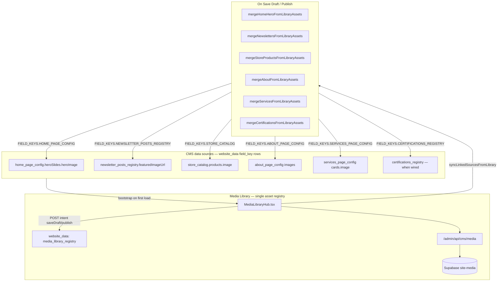

# COPY-PASTE PROMPT — Media Library (PM Structure / pmstructure.com)

Pair with [NEWSLETTER_CONTROL_SYSTEM_PROMPT.md](./NEWSLETTER_CONTROL_SYSTEM_PROMPT.md).

---

## Core idea (read this first)

The Media Library is **not a separate file folder**. It is a **central registry of every image already tied to a CMS record** across the marketing site. When you replace, delete, or edit alt text in the library, those changes **write back** into Home, Newsletter, Store, Certifications, About, Services, etc. on **Save Draft** or **Publish**.

**Current state:** upload/list/delete in Supabase `site-media` + `MediaPicker` in editors. **Target:** full hub-and-spoke registry + write-back (spec below).

| Path | Where | Storage | Appears in Media Library? |
|------|-------|---------|---------------------------|
| **A — Media Library hub** | `/dashboard/site-system/media-library` | Upload → `site-media`; registry in `website_data` | Yes (primary) |
| **B — Inline picker in CMS editors** | Newsletter editor, Home CMS, Store catalog | `POST /admin/api/cms/media` → `site-media` | Yes (aggregated on bootstrap/sync) |

**Do not use:** Portfolio, Discover, Engagement, Insights, blog, or article terminology — PM Structure uses **Newsletter** only.

---

```
# TASK: Build a centralized Media Library that controls all website media for PM Structure (pmstructure.com)

Implement a **Media Library dashboard** that aggregates images from every CMS domain,
lets admins replace/delete/edit alt text in one place, and on Publish writes those
changes back to the correct CMS records (home hero, newsletter covers, store products,
certifications, about team, service cards, etc.).

Model after this monorepo: Next.js App Router, Supabase `website_data` JSONB draft/publish,
Supabase Storage bucket `site-media`, dashboard at `/admin` (basePath).

---

## 1) ARCHITECTURE — HUB AND SPOKE



**Key rule:** The library stores **metadata + URL + linkage** (`sourceType`, `sourceId`, `page`).
It does NOT replace CMS records — it **mirrors and syncs** them.

---

## 2) CUSTOMIZATION WORKSHEET — PM Structure (filled)

| Item | PM Structure value |
|------|-------------------|
| Dashboard route | `/dashboard/site-system/media-library` |
| Website tab nav | Media library + Newsletter (+ Subscribers sub-item) |
| Page filter tabs | all, home, certifications, newsletter, store, community, membership, about, services |
| Public routes per tab | `/`, `/certifications`, `/certifications/[id]`, `/newsletter`, `/newsletter/[slug]`, `/community`, `/community?view=store`, `/membership`, `/about`, `/pm-service` |
| sourceType values | home-hero, newsletter, store-product, about-team, about-story, service-card, certification |
| Supabase registry | `website_data` row `field_key: media_library_registry` |
| File fallback | None (Supabase only) |
| Media bucket | `site-media` |
| Max image size | 8 MB (target); 5 MB today |
| Allowed types | JPEG, PNG, GIF, WEBP (block SVG/HTML on publish path) |
| Auth | `requireDashboardMutationAuth` |
| Terminology | **newsletter** only — never blog, article, insights, posts in UI |

---

## 3) ASSET DATA MODEL

```typescript
interface MediaLibraryAssetRecord {
  id: string
  type: 'image' | 'document' | 'video'
  name: string
  url?: string                  // Supabase public URL or data: URL before persist
  altText?: string
  size: string
  date: string
  page?: MediaLibraryPage
  section?: string
  source: string                // "Home", "Newsletter", "Store"
  context: string               // linked record title
  sourceType?: string           // REQUIRED for write-back
  sourceId?: string             // REQUIRED for write-back
}

type MediaLibraryPage =
  | 'home'
  | 'certifications'
  | 'newsletter'
  | 'store'
  | 'community'
  | 'membership'
  | 'about'
  | 'services'
```

### Dedupe key
`sourceType | sourceId | type | url | page | section`

### Stable id conventions (PM Structure)
| sourceType | id pattern | Example |
|------------|------------|---------|
| home-hero | `home-hero-{slideId}` | `home-hero-1` |
| newsletter | `newsletter-{postId}` | `newsletter-uuid-123` |
| store-product | `store-product-{id}` | `store-product-pmp-mock-pack` |
| about-team | `about-team-{id}` | `about-team-member-1` |
| about-story | `about-story-{id}` | `about-story-main` |
| service-card | `service-card-{id}` | `service-card-advisory` |
| certification | `certification-{id}` | `certification-pmp` |

---

## 4) WHAT GETS AGGREGATED INTO THE LIBRARY

On first load, if registry draft is empty, **bootstrap from draft/published `website_data`**:

| Source CMS (`field_key`) | Condition | page | section | sourceType | sourceId |
|--------------------------|-----------|------|---------|------------|----------|
| `home_page_config.heroSlides[]` | `heroImage.url` set | home | Hero | home-hero | `slide.id` |
| `newsletter_posts_registry.posts[]` | `featuredImageUrl` set | newsletter | Newsletters | newsletter | `post.id` |
| `store_catalog.products[]` | `image.url` or `imageUrl` | store | Products | store-product | `product.id` |
| `about_page_config` team/story | `image.url` set | about | Team / Story | about-team / about-story | record id |
| `services_page_config` cards | `image.url` set | services | Services | service-card | card id |
| `certifications_registry` entries | `imageUrl` when field exists | certifications | Pathways | certification | cert id |

**NOT aggregated (v1):**
- Channel landing `/go/*` images (`@pms/booking-crm` JSON)
- Hardcoded `frontend/data/siteData.ts` cert gradients
- `lib/marketing-stock-images.ts` static URLs
- Legacy `cms_posts_registry` (deprecated — newsletter only)

**Inline upload path B:** `MediaPicker` in `NewsletterPostEditor`, `HomeCmsEditor`, etc. → same `site-media` bucket via `POST /admin/api/cms/media`. Hub re-aggregates on bootstrap or after sync.

---

## 5) PAGE TAB → PUBLIC ROUTE MAP

| Tab (page key) | Public routes revalidated on publish |
|----------------|--------------------------------------|
| home | `/` |
| certifications | `/certifications`, `/certifications/[id]` |
| newsletter | `/newsletter`, `/newsletter/[slug]` |
| store | `/community`, `/community?view=store` |
| community | `/community` |
| membership | `/membership` |
| about | `/about` |
| services | `/pm-service` |

### sourceType → route map
| sourceType | Routes |
|------------|--------|
| home-hero | `/` |
| newsletter | `/newsletter/{slug}`, `/newsletter` |
| store-product | `/community?view=store`, `/community` |
| about-team, about-story | `/about` |
| service-card | `/pm-service` |
| certification | `/certifications`, `/certifications/{id}` |
| (orphan / bucket-only) | no CMS linkage — show under All Pages only |

Implement in: `dashboard/frontend/lib/media/media-library-paths.ts`

---

## 6) API — registry + existing media

### GET `/admin/api/cms/website-data?fieldKey=media_library_registry&view=draft|published`

Or dedicated `/admin/api/media-library-data?view=draft|published` wrapping same storage.

Returns:
```json
{
  "success": true,
  "data": {
    "assets": [],
    "requestedView": "draft",
    "servedView": "draft",
    "isFallback": false,
    "hasDraft": true,
    "hasPublished": true
  }
}
```

**View resolution:**
- `view=draft` → draft assets; fallback to published if draft empty
- `view=published` → published; fallback to draft if empty

**Storage envelope in `website_data.content`:**
```json
{
  "version": 1,
  "draftAssets": [],
  "publishedAssets": []
}
```
Or mirror existing pattern: separate draft/published **rows** per field_key (preferred — same as other CMS keys).

### POST (authenticated)
Body:
```json
{
  "assets": [],
  "intent": "saveDraft" | "publish"
}
```

- `saveDraft` → draft slice only; live site unchanged
- `publish` → published slice + `syncLinkedSourcesFromLibrary` + revalidate paths

### Existing — `/admin/api/cms/media`
- GET list, POST upload, DELETE — Supabase `site-media` bucket
- Used for binary storage; registry holds linkage metadata + URLs

**Auth:** `requireDashboardMutationAuth` on all mutations.

**On publish:** `resolveMediaLibraryIndexingPaths(prev, next)` → `revalidatePath` on marketing `frontend/` routes; optional IndexNow.

---

## 7) DASHBOARD UI

**Route:** `/dashboard/site-system/media-library`  
**Target module:** `dashboard/frontend/components/pages/admin/MediaLibraryHub.tsx`  
**Current (partial):** `MediaLibraryPage.tsx` + `MediaLibraryGrid.tsx`  
**Service (target):** `dashboard/frontend/lib/media/mediaLibraryDataService.ts`  
**Constants:** `dashboard/frontend/constants/websiteCmsPaths.ts`

### 7.1 Layout
- Shell matching other CMS editors (draft actions bar)
- **Page tabs:** All Pages | Home | Certifications | Newsletter | Store | Community | Membership | About | Services
- **View toggle:** Grid | List
- **Filters:** search (name, section, context, alt), type, sort by date/size
- **Actions:** Save Draft | Publish
- **SyncStatusIndicator:** last saved + unsaved changes

### 7.2 Grouping
1. `page` tab filter
2. `section` (Hero, Newsletters, Products, etc.)

### 7.3 Per-asset actions (images)
| Action | Behavior |
|--------|----------|
| **Replace** | File input → validate → upload to `site-media` OR data URL preview → Save Draft / Publish |
| **Delete** | Remove from registry → merge clears CMS image on linked record |
| **Edit alt text** | max 250 chars → synced to `MediaRef.alt` or newsletter alt field on publish |

**Validation:**
- MIME: JPEG, PNG, GIF, WEBP
- Max 8 MB
- Block SVG, HTML

**User messaging:**
- Replace: "Preview updated. Save Draft for draft site; Publish for live pmstructure.com."
- Delete: "Removed from library. Save Draft to sync CMS sources."

### 7.4 Load sequence
```
1. GET registry ?view=draft
2. If assets.length > 0 → use registry
3. Else → bootstrap from website_data field keys (§4)
4. prevSyncedAssetsRef = baseline for merge diff
5. Track unsaved changes vs last successful save
```

---

## 8) SAVE DRAFT / PUBLISH — WRITE-BACK

```typescript
async function syncLinkedSourcesFromLibrary(
  intent: 'saveDraft' | 'publish',
  view: 'draft' | 'published',
) {
  const prev = prevSyncedAssetsRef.current
  const next = assets

  const nextHome = mergeHomeHeroFromLibraryAssets(prev, next, homeConfig)
  const nextNewsletters = mergeNewslettersFromLibraryAssets(prev, next, newsletterRegistry)
  const nextStore = mergeStoreProductsFromLibraryAssets(prev, next, storeCatalog)
  const nextAbout = mergeAboutFromLibraryAssets(prev, next, aboutConfig)
  const nextServices = mergeServicesFromLibraryAssets(prev, next, servicesConfig)
  const nextCerts = mergeCertificationsFromLibraryAssets(prev, next, certRegistry)

  await saveWebsiteData(FIELD_KEYS.HOME_PAGE_CONFIG, nextHome, { intent, view })
  await saveWebsiteData(FIELD_KEYS.NEWSLETTER_POSTS_REGISTRY, nextNewsletters, { intent, view })
  await saveWebsiteData(FIELD_KEYS.STORE_CATALOG, nextStore, { intent, view })
  await saveWebsiteData(FIELD_KEYS.ABOUT_PAGE_CONFIG, nextAbout, { intent, view })
  await saveWebsiteData(FIELD_KEYS.SERVICES_PAGE_CONFIG, nextServices, { intent, view })
  await saveWebsiteData(FIELD_KEYS.CERTIFICATIONS_REGISTRY, nextCerts, { intent, view })
  await saveWebsiteData(FIELD_KEYS.MEDIA_LIBRARY_REGISTRY, { assets: next }, { intent, view })

  prevSyncedAssetsRef.current = next.map(a => ({ ...a }))
}
```

Implement merges in: `dashboard/frontend/lib/media/mergeDomainFromLibraryAssets.ts`

| Case | CMS result |
|------|------------|
| Row exists for sourceType+sourceId | Set image URL + alt |
| Row in prev but removed from next | Clear image URL + alt |
| Never linked | Leave unchanged |

**Home hero:** `heroSlides[].heroImage` (`MediaRef`: `{ id, url, alt }`) keyed by `sourceId = slide.id`.

**Newsletter:** `posts[].featuredImageUrl` + alt (add `imageAlt` to schema if missing).

---

## 9) SECOND UPLOAD PATH — inline CMS editors

**Route:** `POST /admin/api/cms/media` (exists)  
**Auth:** dashboard mutation required  
**Body:** `FormData { file, filename }`  
**Returns:** `{ ok: true, name, url }` — public Supabase URL

Used by:
- `MediaPicker` (`dashboard/frontend/components/pages/admin/site-content/MediaPicker.tsx`)
- `NewsletterPostEditor` featured image
- `HomeCmsEditor` hero slides

No separate `discover-assets` API on PM Structure — all uploads go to `site-media`.

---

## 10) CMS FIELD MAPPING (public site reads published data)

| Public UI | CMS field | Updated by library merge |
|-----------|-----------|--------------------------|
| Homepage hero | `home_page_config.heroSlides[].heroImage` | ✅ home-hero |
| Newsletter cover | `newsletter_posts_registry.posts[].featuredImageUrl` | ✅ newsletter |
| Resource store card | `store_catalog.products[].image` / `imageUrl` | ✅ store-product |
| About team photo | `about_page_config` team `image` | ✅ about-team |
| PM Service card | `services_page_config` card `image` | ✅ service-card |
| Cert pathway card | `certifications_registry` / `siteData` | ⚠️ after images wired |
| Community mentorship | `MARKETING_STOCK_IMAGES` | ❌ static until CMS |

Public pages use `usePublishedSiteDocument` / `WebsiteDataService.getData('published')` — **not** the library API directly.

---

## 11) SEO / CACHE AFTER PUBLISH

1. `resolveMediaLibraryIndexingPaths(previousPublished, nextPublished)`
2. Call marketing app revalidation for affected paths (§5)
3. Optional: `npm run seo:indexnow` when `INDEXNOW_KEY` set

---

## 12) FILES TO CREATE / MODIFY

```
dashboard/frontend/app/dashboard/site-system/media-library/page.tsx     # exists
dashboard/frontend/components/pages/admin/MediaLibraryHub.tsx           # target — extend MediaLibraryPage
dashboard/frontend/components/pages/admin/site-content/MediaLibraryGrid.tsx  # exists — keep for picker
dashboard/frontend/components/pages/admin/site-content/MediaPicker.tsx       # exists
dashboard/frontend/lib/cms/media-api.ts                                      # exists
dashboard/frontend/lib/media/mergeDomainFromLibraryAssets.ts                 # NEW
dashboard/frontend/lib/media/media-library-paths.ts                            # NEW
dashboard/frontend/lib/media/mediaLibraryDataService.ts                        # NEW
dashboard/frontend/hooks/useMediaLibraryRegistry.ts                            # NEW
dashboard/backend/app/api/cms/media/route.ts                                   # exists
dashboard/backend/app/api/media-library-data/route.ts                          # NEW (optional wrapper)
packages/site-content/src/media-library.ts                                     # NEW schema
packages/site-content/src/keys.ts                                              # add MEDIA_LIBRARY_REGISTRY
```

---

## 13) EXTENDING PM Structure

Example — membership tier image:
```typescript
// bootstrap:
membershipTiers.forEach(tier => {
  if (!tier.image?.url) return
  list.push({
    id: `membership-tier-${tier.id}`,
    type: 'image',
    url: tier.image.url,
    altText: tier.image.alt,
    page: 'membership',
    section: 'Tiers',
    source: 'Membership',
    context: tier.name,
    sourceType: 'membership-tier',
    sourceId: tier.id,
    name: tier.name,
    size: 'Unknown',
    date: tier.updatedAt ?? '',
  })
})
```

Steps: sourceType → bootstrap → merge function → syncLinkedSourcesFromLibrary → path map → public page reads published CMS.

---

## 14) ACCEPTANCE CRITERIA

- [ ] Library bootstraps linked images from CMS on first visit
- [ ] Page tabs filter correctly (PM Structure pages only — no Portfolio/Discover/Insights)
- [ ] Replace → Save Draft updates draft CMS; Publish updates pmstructure.com
- [ ] Delete clears linked CMS image after save
- [ ] Alt text on public `` after publish
- [ ] Unsaved changes indicator; baseline resets after save
- [ ] Home + Newsletter + Store + About + Services update from one Publish
- [ ] Inline MediaPicker uploads appear in hub after bootstrap/sync
- [ ] Publish revalidates affected public routes
- [ ] Mutations require dashboard auth
- [ ] UI says **newsletter** / **media** only — never blog, article, insights

---

## 15) REFERENCE PATHS (PM Structure repo)

| Piece | Path |
|-------|------|
| UI (current) | `dashboard/frontend/components/pages/admin/MediaLibraryPage.tsx` |
| Grid | `dashboard/frontend/components/pages/admin/site-content/MediaLibraryGrid.tsx` |
| Picker | `dashboard/frontend/components/pages/admin/site-content/MediaPicker.tsx` |
| Media API (client) | `dashboard/frontend/lib/cms/media-api.ts` |
| Media API (server) | `dashboard/backend/app/api/cms/media/route.ts` |
| Website data API | `dashboard/backend/app/api/cms/website-data/route.ts` |
| CMS keys | `packages/site-content/src/keys.ts` |
| Home hero schema | `packages/site-content/src/home.ts` |
| Newsletter images | `packages/site-content/src/newsletter-posts.ts` |
| Store images | `packages/site-content/src/store.ts` |
| Routes constants | `dashboard/frontend/constants/websiteCmsPaths.ts` |
| Wiring audit | `docs/cms-audit/WIRING_MATRIX.md` |

END OF PROMPT
```

---

## Quick mental model (PM Structure)

1. **Bootstrap** — Library reads images from `home_page_config`, `newsletter_posts_registry`, `store_catalog`, `about_page_config`, `services_page_config`.
2. **Edit in one place** — Replace, delete, alt text in Media Library UI.
3. **Save Draft** — Updates registry draft + pushes URLs into draft `website_data` rows.
4. **Publish** — Same with published slice; `pmstructure.com` reads published CMS.
5. **Inline upload** — `MediaPicker` → `site-media`; hub aggregates on bootstrap/sync.

---

## Implementation status (2026-06)

| Feature | Status |
|---------|--------|
| `site-media` upload/list/delete | ✅ Done |
| `MediaPicker` in editors | ✅ Done |
| Registry + bootstrap + write-back | ❌ Not built |
| Page tabs + alt editor + Save/Publish hub | ❌ Not built |
